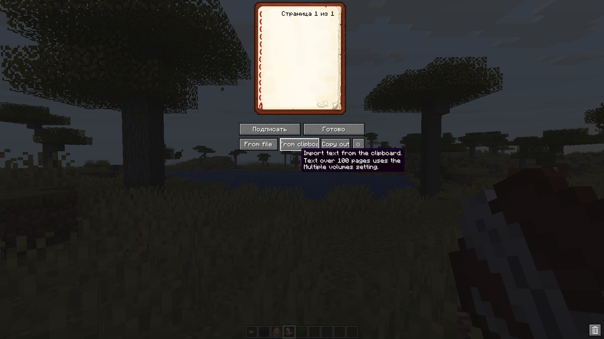
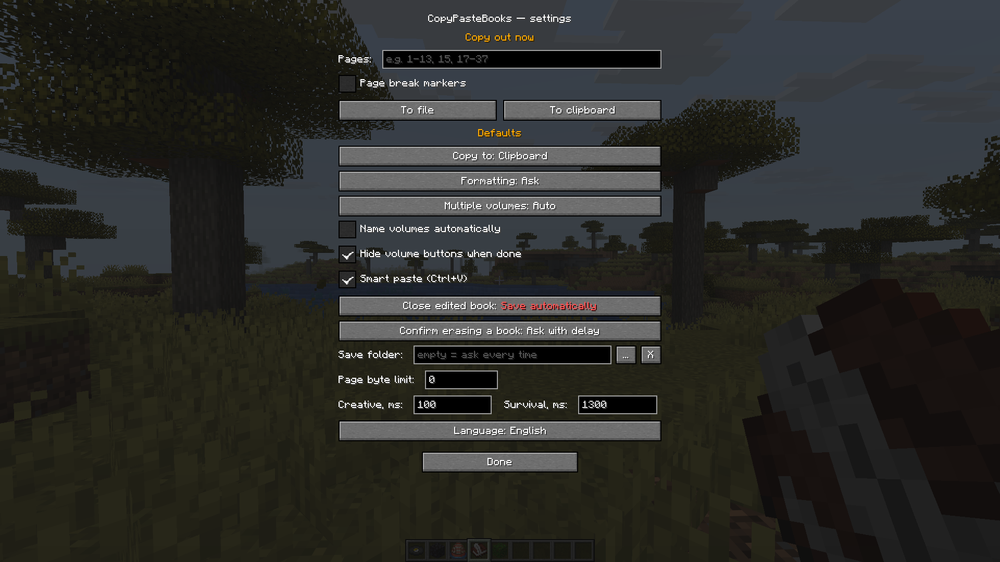
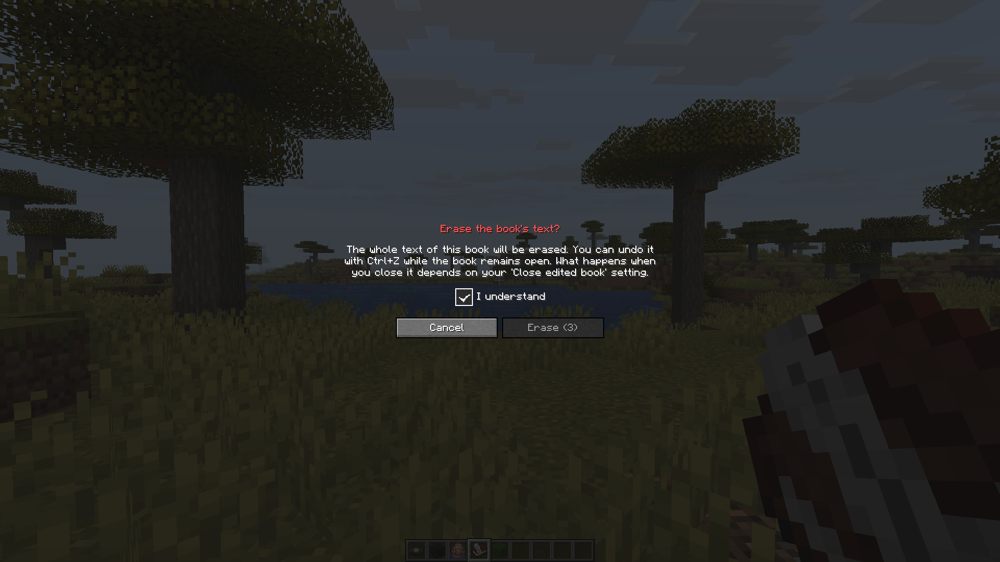
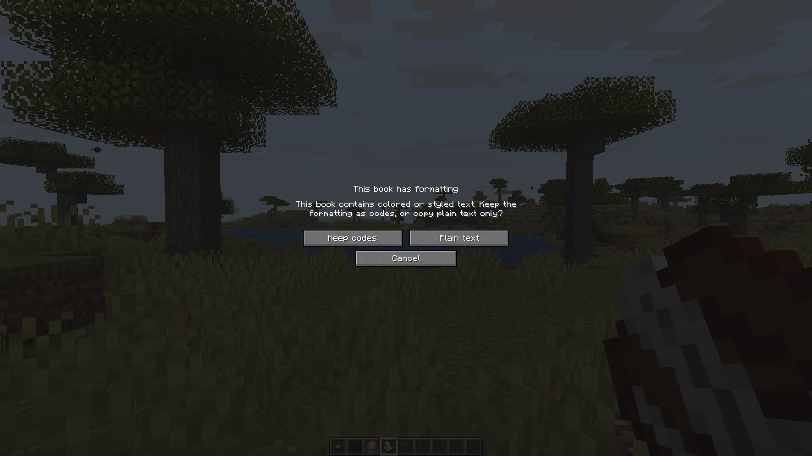

# CopyPasteBooks

**English** · [Русский](README_RU.md)

CopyPasteBooks is a client-side mod for Minecraft **26.1–26.2** (Fabric and NeoForge). It moves book text between Minecraft, `.txt` files, and the clipboard; longer texts can be split across several books.

Server plugins may still reject or filter books that are too large or contain blocked characters.

## Screenshots

<table>
  <tr>
    <td align="center"><a href="docs/screenshots/book-controls.png"></a><br><sub>Book controls</sub></td>
    <td align="center"><a href="docs/screenshots/settings.png"></a><br><sub>Settings</sub></td>
  </tr>
  <tr>
    <td align="center"><a href="docs/screenshots/erase-confirmation.png"></a><br><sub>Erase confirmation</sub></td>
    <td align="center"><a href="docs/screenshots/formatting-choice.png"></a><br><sub>Formatting choice</sub></td>
  </tr>
</table>

## Installation

Fabric and NeoForge use separate JARs; each build supports the whole 26.1–26.2 range. Java 25 is required, so check the selected runtime when using a third-party launcher.

- **Fabric:** put `copypastebooks-fabric-<version>.jar` in `mods` and install [Fabric API](https://modrinth.com/mod/fabric-api). Mod Menu is optional.
- **NeoForge:** put `copypastebooks-neoforge-<version>.jar` in `mods`.

To build from source, run `./gradlew clean build` from the repository root (`gradlew.bat clean build` on Windows). The JARs are written to `fabric/build/libs` and `neoforge/build/libs`.

## Book controls

The book and quill editor gets these controls:

| Button | Action |
|---|---|
| **From file** | Import text from a `.txt` file |
| **From clipboard** | Import text from the clipboard |
| **Copy out** | Copy the whole book to the default destination |
| **⚙** | Open settings or copy a page range |
| **🗑** | Erase the book's text |
| **Load N/M**, `^`, `v`, `X` | Pick and load Manual volumes, or end the current volume import |

**Copy out** and **⚙** also appear when reading a signed book.

## Commands

All commands are client-side and support tab completion.

- `/copybook [clipboard|file]` — copy the held book, signed or unsigned.
- `/importbook [clipboard|file] [auto|manual]` — import text without opening the editor. A one-book or Manual import needs a held book and quill; the second argument matters only when the text needs more than one book.
- `/copypastebooks` — open settings.
- `/copypastebooks en|ru|auto` — choose the interface language; `auto` follows the game language.
- `/copypastebooks delay creative|survival <ms>` — set the pause between books.

Without optional arguments, copy and import commands use the configured destination and volume method.

## Copying books out

Books are copied to the clipboard by default. The destination can be changed in settings or overridden once with `/copybook`. Open **⚙** from a book to copy a range such as `1-13, 15, 17-37`; an empty range means the whole book.

Page markers add a line before every exported page:

```text
=== Page 5 ===
```

Importing marked text restores the page breaks as long as each marked page still fits. An oversized page is laid out again. `=== Страница 5 ===` is accepted too; marker order matters, but the numbers do not. A regular text line matching this pattern is treated as a marker as well.

### Formatting

When **Formatting** is set to **Ask** (the default), the choice appears only if the selected pages actually use color or styling.

- **Keep § codes** writes styles as legacy codes such as `§6` and `§l`. Hex colors are mapped to the nearest legacy color. Click and hover actions are not exported.
- **Plain text** keeps only the visible text.

### Saving to files

With no save folder set, the mod opens a system save dialog. If a folder is set, files go there directly and the chat message links to the saved file. Signed books use their title for the filename; an unsigned draft becomes `book_<date>`. For direct folder saves, existing names receive a suffix such as ` (2)`.

Use `...` to choose a folder, or enter its path manually. The `X` beside the field clears it and brings the save dialog back.

## Importing text

**From file** and **From clipboard** replace the open draft for a one-book or Manual import. A longer Auto import closes the editor and creates or fills the volume books instead. `/importbook` starts the same import without opening the editor. Without page markers, text is laid out by the in-game font; breaks prefer newlines and spaces, and split a word only when necessary.

For a single-book or Manual import from a file, the sign screen suggests the filename as the title. Manual volumes also get their volume number. Clipboard text has no filename, and Auto volume titles are controlled separately by **Name volumes automatically**.

Some servers limit pages by bytes as well as characters. **Page byte limit** applies to button imports and `/importbook`; `0` means an automatic limit of 2048 bytes. If even one character exceeds a custom limit, the import stops with an error instead of dropping that character.

## Smart paste

Smart paste is enabled by default. Ctrl+V inserts text at the cursor and continues onto following pages when the current one fills up. A selection is replaced as usual; text outside it is moved forward rather than lost.

Ctrl+Z undoes edits and Ctrl+Shift+Z redoes them (Cmd on macOS). Typing, each paste, erasing the book, and loading a volume are recorded as separate steps. The cursor and selection are restored too. Undo history lasts until the editor is closed.

If a paste would push existing text past the end of the book, it is refused and nothing changes. When pasting at the end, a tail that does not fit is cut off with a warning; the whole paste can still be undone with Ctrl+Z.

Smart paste treats page-marker lines literally and does not use the configured byte limit. For unmarked text in an empty book, it produces the same page breaks as a button import unless that byte limit makes the button split earlier. Turning Smart paste off restores vanilla single-page Ctrl+V; undo and redo remain available.

## Multiple volumes

A Minecraft book holds 100 pages. Longer imports are divided into volumes; **Multiple volumes** in settings, or `auto|manual` in `/importbook`, selects how they are handled.

### Auto

Auto is the default method.

- In creative, empty books and quills already in the inventory are reused first. Remaining volumes need free inventory slots. If there is not enough room, the mod fills what it can and reports the rest.
- In survival, the mod fills empty books and quills from the hotbar and off-hand, up to ten at a time. It does not create books. If there are too few, it asks whether to fill the available ones.
- Books are sent with a configurable pause to avoid server rate limits. The defaults are 100 ms in creative and 1300 ms in survival.
- **Name volumes automatically** is off by default. When enabled, the mod asks for a name and signs the volumes as `Name - 1`, `Name - 2`, and so on. A name ending in a digit uses Roman numerals instead (`Chapter2 II`). Titles are shortened to Minecraft's limit.

### Manual

Manual loads one volume at a time. In the editor, choose a volume with `^` and `v`, then press **Load N/M**. Save the current book with **Done** or sign it, put it away, take a fresh book and quill, and continue. The same flow works by repeating `/importbook`; the previous volume does not have to be signed.

The volume buttons disappear once every volume has been loaded. Turn off **Hide volume buttons when done** to keep them. `X` ends the current Manual import.

### Colored numbers

Auto without automatic naming leaves the volumes unsigned. To make them easier to sort and sign later, the mod draws a small colored number where the stack count normally appears. The color identifies one import, and the number gives the volume order.

This mark is local and temporary. It is not stored in the book and other players cannot see it. It stays with the book while its text is edited or while it is moved within the player's inventory, hotbar, or off-hand. The mark is removed when the book is signed, erased, filled with a new import, put into a container, dropped, or when the player leaves the world or server.

## Erasing and closing

By default the trash button requires a checkbox and a three-second wait; settings can keep the confirmation without the wait or remove it. Ctrl+Z restores the text while the same editor remains open.

Escape and the inventory key follow **Close edited book** when the draft has changed:

- **Ask** (default) — choose **Save and close**, **Close without saving**, or **Continue editing**.
- **Save automatically** — save the same changes as **Done**, then close.
- **Discard (game default)** — close and discard the draft.

An unchanged book closes immediately.

## Settings

Settings open with `/copypastebooks`, with **⚙** in a book, from the NeoForge mod list, or through Mod Menu on Fabric. Every option has a short tooltip in game. The config file is `config/copypastebooks.json`.

## Files and limits

- Minecraft limits books to 100 pages, 1024 characters per page, and 15 characters in a title.
- File and folder pickers are system windows. The game remains usable while one is open, although fullscreen Minecraft may minimize on Windows. Only one picker can be open at a time.
- Text files are read as UTF-8, with windows-1251 as a fallback and a leading UTF-8 BOM removed. Files are saved as UTF-8.
